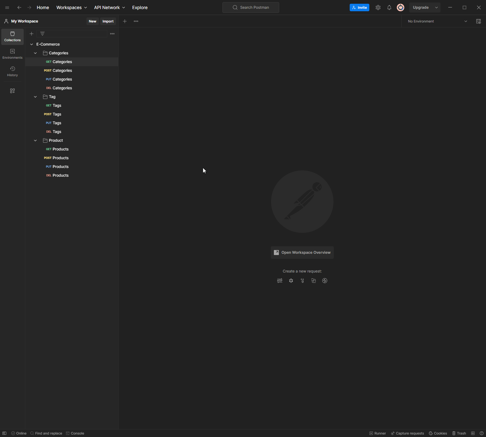

# e-commerce


[](https://nodejs.org/download/release/latest-v16.x/)
[
](https://www.npmjs.com/package/mysql)


## Screenshot



## Description

Backend for a e-commerce API! A small but relatively simple complete API using expresss with the ability to create, read, update and delete products, tags or categories; while saved on a local MySQL database which allows for data to be managed using sequelize in JavaScript.

This was made to explore how the backend of a web shop would function and work in conjuction with a database where data would be retrieved and sent. It also allowed me to gain an increase in confidence of using Sequelize as a way to interact with an SQL database.

I am now more comfortable using Sequelize to manage the CRUD process of an SQL server and avoid using raw SQL syntax. 

## Table of Contents

- [Installation](#installation)
- [Usage](#usage)
- [Credits](#credits)
- [License](#license)

## Installation 

I would recommend watching my full guide [here](CHANGE_ME) for a more streamlined experience. If not, see below.

### Written Tutorial

You will require [node.js v16.18.0](https://nodejs.org/download/release/latest-v16.x/) in order for this to work.

You will also need to install mySQL. Installation guide from the official [website](https://dev.mysql.com/doc/mysql-installation-excerpt/8.0/en/windows-install-archive.html)

Once done, continue below.

To run the application, you will need to first clone it to your local client, once cloned open the code is VS Code and open your terminal. 

### NPM

Place the following commands into you CLI.

```sh
npm i
```

You will now have the necessary NPMs needed to run the application.

You will now need to set-up your .env file. There is an example file in the directory. Enter the neccessarydetails in order to use mySQL.
 
```dosini
# .env, repo example
DB_NAME='<insert db name>'
DB_USER=''
DB_PASSWORD=''
```

Example of  

```dosini
# .env, private (example)
DB_NAME='ecommerce_db'
DB_USER='root'
DB_PASSWORD='password123'
```

Once you have configured your .env file, you are now ready to start the application.

### mySQL

You will first need to seed the application with mySQL.

```sh
mysql -u root -p
```

After entering the command, you will be prompted with placing your password, type your password then follow the bellow.

This will create the database on your local machine. Once done you can quit.

```sh
source db/schema.sql
```

```sh
quit;
```

You'll be taken back to the standard terminal, the below command will seed the database with some starter items.

```sh
npm run seed
```

### Running the application

The below will run the application!

```sh
npm run start
```

You will need an external tool like [Postman](https://www.postman.com/) or Insomnia(https://insomnia.rest/) to interact with the API.

## License

[](https://unlicense.org/)

Infomation on the Unlince can be found [here](https://unlicense.org/)

## Credits

[Sequelize Documentation](https://sequelize.org/docs/v6/core-concepts/model-querying-basics/) - Sequelize documentation how the models work, model quering etc.